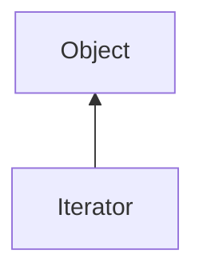

#### Inheritance Graph

## Functions

|
| --------------------------------------------------------------------------------------------------: | ------------------------ | 
| **[end](classEScript_1_1Iterator#classEScript_1_1Iterator_1a287d6f533026d0394643fc6b2eb29219)**()   | Bool Iterator.end()      | 
| **[key](classEScript_1_1Iterator#classEScript_1_1Iterator_1a5505a1e0af494232455daf7fe487a8ec)**()   | Object Iterator.key()    | 
| **[next](classEScript_1_1Iterator#classEScript_1_1Iterator_1ab6fd313c7247309bac0d3857dee6c1c4)**()  | thisObj Iterator.next()  | 
| **[reset](classEScript_1_1Iterator#classEScript_1_1Iterator_1ae53c923e25ad0a039782930a530cba12)**() | thisObj Iterator.reset() | 
| **[value](classEScript_1_1Iterator#classEScript_1_1Iterator_1a0097b916482a156c7c45c8615d829100)**() | Object Iterator.value()  | 
{: .nohead .nowrap1 }

