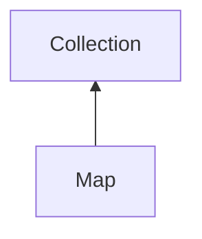

#### Inheritance Graph

## Functions

|
| -------------------------------------------------------------------------------------------------: | ---------------------------------------------------------------------------------------- | 
| **_constructor**([p0])                                                                             | [ESMF] Map new Map( [key,value]\* )                                                      | 
| **containsKey**(p0)                                                                                | [ESMF] bool Collection.containsKey(Object)                                               | 
| **filter**(p0)                                                                                     | [ESMF] thisObj Map.filter( fn(key,value){return false\|true;} [,additionalParameter\*] ) | 
| **[merge](classEScript_1_1Map#classEScript_1_1Map_1a66888a941e36a39b7c068b203b555c3f)**(p0 [, p1]) | [ESMF] thisObj Map.merge( Collection [,bool overwrite = true] )                          | 
| **[swap](classEScript_1_1Map#classEScript_1_1Map_1aa1f50096c32fc225079f0859caca487e)**(p0)         | [ESMF] thisObj swap.swap( Map other )                                                    | 
| **[unset](classEScript_1_1Map#classEScript_1_1Map_1a246ae39c2d0516ec17fc8a3f52d9013a)**(p0)        | [ESMF] thisObj Map.unset( key )                                                          | 
{: .nohead .nowrap1 }

