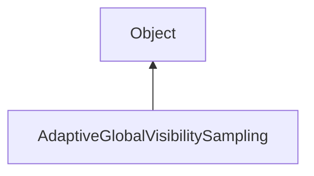

#### Inheritance Graph

## Functions

|
| ------------------------------------------------------------------------------------------------------------------------------------------------------------------------------: | ----------------------------------------------------------------------------------- | 
| **_constructor**(p0, p1)                                                                                                                                                        | [ESF] new AGVS.AdaptiveGlobalVisibilitySampling(GroupNode, ValuatedRegionNode)      | 
| **[createMeshFromSamples](classMinSG_1_1AGVS_1_1AdaptiveGlobalVisibilitySampling#classMinSG_1_1AGVS_1_1AdaptiveGlobalVisibilitySampling_1ab0458a30a1ad65a5c4c5f47686f6e6c5)**() | [ESMF] E_Rendering::E_Mesh AdaptiveGlobalVisibilitySampling.createMeshFromSamples() | 
| **[getViewCellHierarchy](classMinSG_1_1AGVS_1_1AdaptiveGlobalVisibilitySampling#classMinSG_1_1AGVS_1_1AdaptiveGlobalVisibilitySampling_1a3f751b62ed7addf5f5ebe8e1e879003b)**()  | [ESMF] ValuatedRegionNode AdaptiveGlobalVisibilitySampling.getViewCellHierarchy()   | 
| **[performSampling](classMinSG_1_1AGVS_1_1AdaptiveGlobalVisibilitySampling#classMinSG_1_1AGVS_1_1AdaptiveGlobalVisibilitySampling_1a1795c7c0cf51baa173b0d53bf04af93c)**(p0)     | [ESMF] Bool AdaptiveGlobalVisibilitySampling.performSampling(Number)                | 
{: .nohead .nowrap1 }

