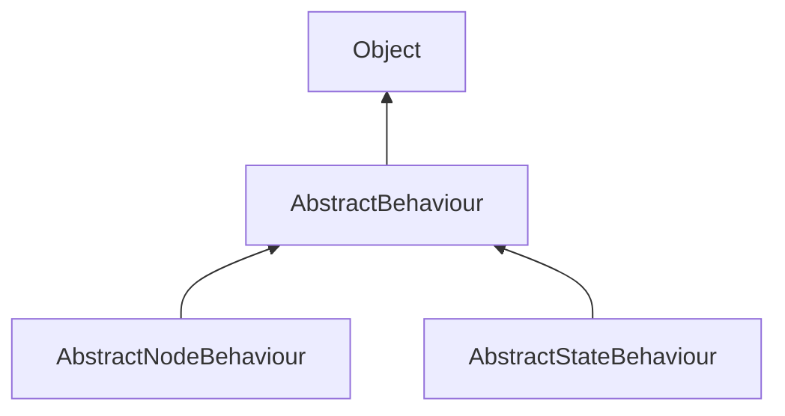

#### Inheritance Graph

## Attributes

|
| -----------: | -- | 
| **CONTINUE** |  | 
| **FINISHED** |  | 
{: .nohead .nowrap1 }

## Functions

|
| -------------------------------------------------------------------------------------------------------------------------: | ----------------------------------------- | 
| **[getCurrentTime](classMinSG_1_1AbstractBehaviour#classMinSG_1_1AbstractBehaviour_1ae3f865b4747b68afd509249c112fcf9d)**() | Number AbstractBehaviour.getCurrentTime() | 
| **[getLastTime](classMinSG_1_1AbstractBehaviour#classMinSG_1_1AbstractBehaviour_1a5b3d2b979987c1a11611ed7b7e94b474)**()    | Number AbstractBehaviour.getLastTime()    | 
| **[getTimeDelta](classMinSG_1_1AbstractBehaviour#classMinSG_1_1AbstractBehaviour_1a1b0cea4c0393fc3a8521bdaeb9fea5be)**()   | Number AbstractBehaviour.getTimeDelta()   | 
{: .nohead .nowrap1 }

