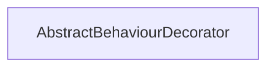

#### Inheritance Graph

## Functions

|
| ---------------------------------------------------------------------------------------------------------------------------------------------: | --------------------------------------------------------------- | 
| **[getDecorated](classMinSG_1_1AbstractBehaviourDecorator#classMinSG_1_1AbstractBehaviourDecorator_1aff1207ada09fb12075803cb9e734ba01)**()     | AbstractBehaviour AbstractBehaviourDecorator.getDecorated()     | 
| **[getDecoratedRoot](classMinSG_1_1AbstractBehaviourDecorator#classMinSG_1_1AbstractBehaviourDecorator_1af50b005a2f13ce619cd50933ab3d4718)**() | AbstractBehaviour AbstractBehaviourDecorator.getDecoratedRoot() | 
{: .nohead .nowrap1 }

