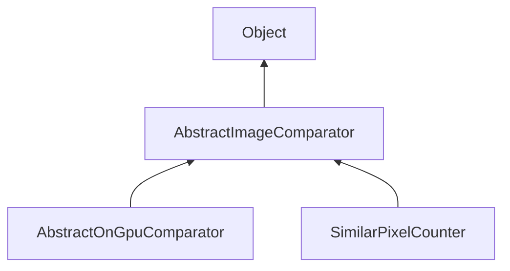

#### Inheritance Graph

## Functions

|
| -------------------------------------------------------------------------------------------------------------------------------------------------------------------------------: | ------------------------------------------------------------------------------------------------------ | 
| **[compare](classMinSG_1_1ImageCompare_1_1AbstractImageComparator#classMinSG_1_1ImageCompare_1_1AbstractImageComparator_1a6bab629844d44d816ce33422da4656a8)**(p0, p1, p2 [, p3]) | [ESMF] [Number, void] ImageComparator.compare(RenderingContext, Texture inA, Texture inB, Texture out) | 
{: .nohead .nowrap1 }

