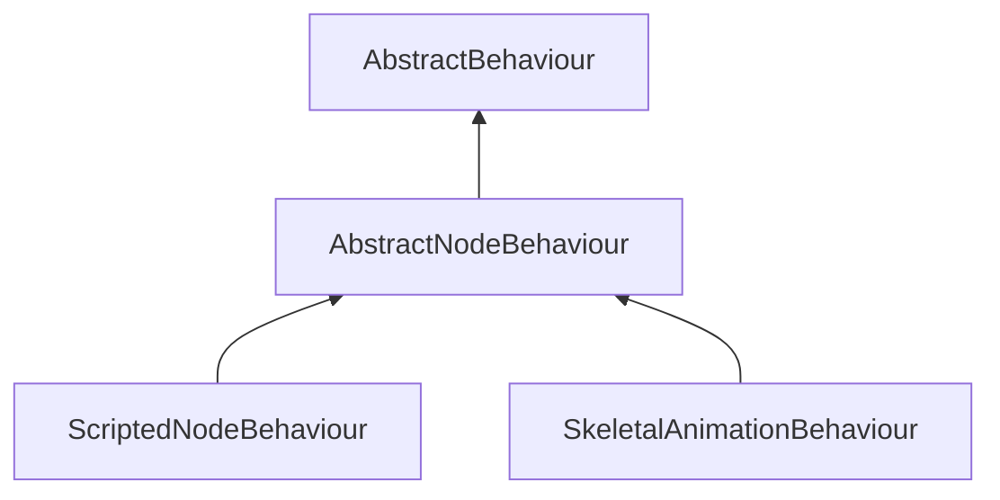

#### Inheritance Graph

## Functions

|
| ----------------------------------------------------------------------------------------------------------------------------: | ----------------------------------------------- | 
| **[getNode](classMinSG_1_1AbstractNodeBehaviour#classMinSG_1_1AbstractNodeBehaviour_1a629e852efd8f48384cf2a15394ad1b0e)**()   | [ESMF] Node AbstractNodeBehaviour.getNode()     | 
| **[setNode](classMinSG_1_1AbstractNodeBehaviour#classMinSG_1_1AbstractNodeBehaviour_1a141d9b518a6df826a871482b96d2f4fa)**(p0) | [ESMF] seld AbstractNodeBehaviour.setNode(Node) | 
{: .nohead .nowrap1 }

