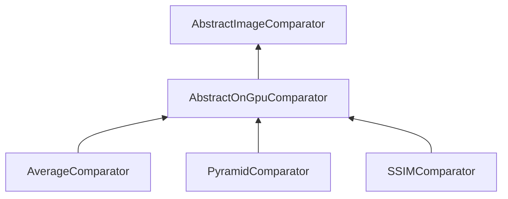

#### Inheritance Graph

## Attributes

|
| --------: | -- | 
| **BOX**   |  | 
| **GAUSS** |  | 
{: .nohead .nowrap1 }

## Functions

|
| -------------------------------------------------------------------------------------------------------------------------------------------------------------------------------: | ---------------------------------------------------------------------- | 
| **[getFilterSize](classMinSG_1_1ImageCompare_1_1AbstractOnGpuComparator#classMinSG_1_1ImageCompare_1_1AbstractOnGpuComparator_1af801058df5427868fbd5deda11262320)**()            | [ESMF] Number AbstractOnGpuComparator.getFilterSize()                  | 
| **[getFilterType](classMinSG_1_1ImageCompare_1_1AbstractOnGpuComparator#classMinSG_1_1ImageCompare_1_1AbstractOnGpuComparator_1a2d6fcc2015105dcd96127e0fb66228d7)**()            |                                                                        | 
| **[getTextureDownloadSize](classMinSG_1_1ImageCompare_1_1AbstractOnGpuComparator#classMinSG_1_1ImageCompare_1_1AbstractOnGpuComparator_1a3a14377dcbdd6d36b0037dd40a5414c1)**()   | [ESMF] Number AbstractOnGpuComparator.getTextureDownloadSize()         | 
| **[initShaderFileLocator](classMinSG_1_1ImageCompare_1_1AbstractOnGpuComparator#classMinSG_1_1ImageCompare_1_1AbstractOnGpuComparator_1a7203f6e347c9bb7fd74684ddc1b56512)**(p0)  | void AbstractOnGpuComparator.initShaderFileLocator(Util.FileLocator)   | 
| **[setFBO](classMinSG_1_1ImageCompare_1_1AbstractOnGpuComparator#classMinSG_1_1ImageCompare_1_1AbstractOnGpuComparator_1af870eea0c775acd361573cb201acfa94)**(p0)                 | [ESMF] self AbstractOnGpuComparator.setFBO(FBO)                        | 
| **[setFilterSize](classMinSG_1_1ImageCompare_1_1AbstractOnGpuComparator#classMinSG_1_1ImageCompare_1_1AbstractOnGpuComparator_1ab8cac741afab5b44670f0b7edfa30f7c)**(p0)          | [ESMF] self AbstractOnGpuComparator.setFilterSize(Bool)                | 
| **[setFilterType](classMinSG_1_1ImageCompare_1_1AbstractOnGpuComparator#classMinSG_1_1ImageCompare_1_1AbstractOnGpuComparator_1a7fc766407a0b1d01a3064c44fe2c0960)**(p0)          |                                                                        | 
| **[setTextureDownloadSize](classMinSG_1_1ImageCompare_1_1AbstractOnGpuComparator#classMinSG_1_1ImageCompare_1_1AbstractOnGpuComparator_1a4383bc933d0c5611d977887fb7a5cabe)**(p0) | [ESMF] self AbstractOnGpuComparator.setTextureDownloadSize(sideLength) | 
{: .nohead .nowrap1 }

