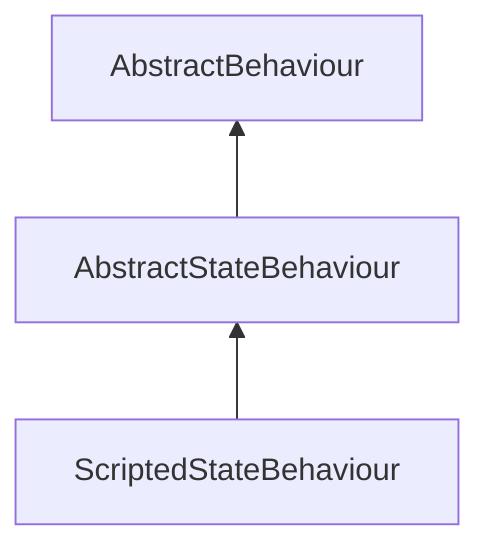

#### Inheritance Graph

## Functions

|
| -----------------------------------------------------------------------------------------------------------------------------: | ---------------------------------------------- | 
| **[getState](classMinSG_1_1AbstractStateBehaviour#classMinSG_1_1AbstractStateBehaviour_1a24142c4418161988f8381a8566749191)**() | [ESMF] State AbstractStateBehaviour.getState() | 
{: .nohead .nowrap1 }

