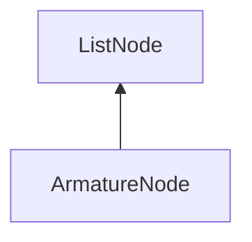

#### Inheritance Graph

```mermaid
graph BT
	ArmatureNode
	ArmatureNode --> ListNode
	click ArmatureNode "escript_type_MinSG_ArmatureNode"
	click ListNode "escript_type_MinSG_ListNode"
```

## Functions

|
| -----------------: | --------------------------------- | 
| **_constructor**() | [ESMF] new MinSG.ArmatureNode( )	 | 
{: .nohead .nowrap1 }

