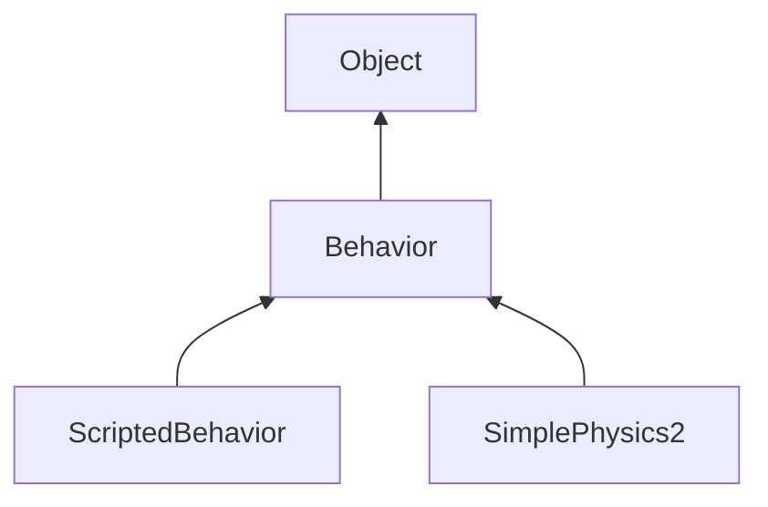

#### Inheritance Graph

```mermaid
graph BT
	Behavior
	Behavior --> Object
	ScriptedBehavior --> Behavior
	SimplePhysics2 --> Behavior
	click Behavior "escript_type_MinSG_Behavior"
	click Object "escript_type_Object"
	click ScriptedBehavior "escript_type_MinSG_ScriptedBehavior"
	click SimplePhysics2 "escript_type_MinSG_SimplePhysics2"
```

## Attributes

|
| -----------: | -- | 
| **CONTINUE** |  | 
| **FINISHED** |  | 
{: .nohead .nowrap1 }

