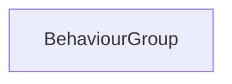

#### Inheritance Graph

## Functions

|
| ----------------------------------------------------------------------------------------------------------------------: | ------------------------------------------------------------------- | 
| **_constructor**()                                                                                                      | new BehaviourGroup( )                                               | 
| **[addBehaviour](classMinSG_1_1BehaviourGroup#classMinSG_1_1BehaviourGroup_1aa66865b19a91c414a5d64880e90a1c4c)**(p0)    | [ESMF] self MinSG.BehaviourGroup.addBehaviour(AbstractBehaviour)    | 
| **[count](classMinSG_1_1BehaviourGroup#classMinSG_1_1BehaviourGroup_1a3e0fe4bab3f9605c5b7bb2ce78f17c92)**()             | [ESMF] Number MinSG.BehaviourGroup.count()                          | 
| **[removeBehaviour](classMinSG_1_1BehaviourGroup#classMinSG_1_1BehaviourGroup_1aa6e42b0d01c80b450bb1b4835295003d)**(p0) | [ESMF] self MinSG.BehaviourGroup.removeBehaviour(AbstractBehaviour) | 
{: .nohead .nowrap1 }

