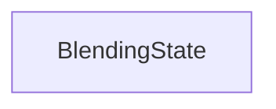

#### Inheritance Graph

## Functions

|
| ----------------------------------------------------------------------------------------------------------------------------------------: | ------------------------------------------------------------------------- | 
| **_constructor**([p0])                                                                                                                    | [ESF] BlendingState new BlendingState()                                   | 
| **getBlendConstAlpha**()                                                                                                                  | [ESMF] number new BlendingState.getBlendConstAlpha()                      | 
| **[getBlendDepthMask](classMinSG_1_1BlendingState#classMinSG_1_1BlendingState_1a18d79ddb1881ada343af1696f2de9d63)**()                     | [ESMF] Bool new BlendingState.getBlendDepthMask()                         | 
| **getBlendEquation**()                                                                                                                    | [ESMF] number new BlendingState.getBlendEquation()                        | 
| **getBlendFuncDst**()                                                                                                                     | [ESMF] number new BlendingState.getBlendFuncDst()                         | 
| **getBlendFuncSrc**()                                                                                                                     | [ESMF] number new BlendingState.getBlendFuncSrc()                         | 
| **[getParameters](classMinSG_1_1RenderingParametersState#classMinSG_1_1RenderingParametersState_1abc0891cd567b279a86f85f978452b010)**()   | [ESMF] Rendering.BlendingParameters BlendingState.getParameters()         | 
| **setBlendConstAlpha**(p0)                                                                                                                | [ESMF] thisEObj BlendingState.setBlendConstAlpha(Number)                  | 
| **[setBlendDepthMask](classMinSG_1_1BlendingState#classMinSG_1_1BlendingState_1a303363507412c6457ce08236975cc2e8)**(p0)                   | [ESMF] thisEObj BlendingState.setBlendDepthMask(Bool)                     | 
| **[setBlendEquation](classRendering_1_1BlendingParameters#classRendering_1_1BlendingParameters_1af7130ce205fd6391e436989733dfcf73)**(p0)  | [ESMF] thisEObj BlendingState.setBlendEquation(Number)                    | 
| **setBlendFuncDst**(p0)                                                                                                                   | [ESMF] thisEObj BlendingState.setBlendFuncDst(Number)                     | 
| **setBlendFuncSrc**(p0)                                                                                                                   | [ESMF] thisEObj BlendingState.setBlendFuncSrc(Number)                     | 
| **[setParameters](classMinSG_1_1RenderingParametersState#classMinSG_1_1RenderingParametersState_1a4e9f8bfdd58c370bb046aef0945335c4)**(p0) | [ESMF] thisEObj BlendingState.setParameters(Rendering.BlendingParameters) | 
{: .nohead .nowrap1 }

