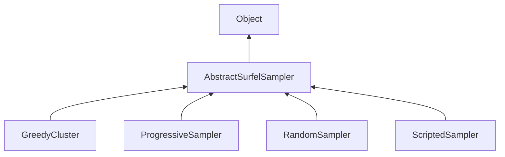

#### Inheritance Graph

## Functions

|
| -----------------------------------------------------------------------------------------------------------------------------------------------------------------------: | ---------------------------------------------------------------------------------- | 
| **[clearStatistics](classMinSG_1_1BlueSurfels_1_1AbstractSurfelSampler#classMinSG_1_1BlueSurfels_1_1AbstractSurfelSampler_1a8d2efc884545ffd0030af1a927cd82cb)**()        | [ESMF] self AbstractSurfelSampler.clearStatistics()                                | 
| **[finalizeMesh](classMinSG_1_1BlueSurfels_1_1AbstractSurfelSampler#classMinSG_1_1BlueSurfels_1_1AbstractSurfelSampler_1ae78639c65e605ab77b5ebd0144c9ccb0)**(p0, p1)     | [ESMF] Mesh AbstractSurfelSampler.finalizeMesh(Mesh sourceMesh, Array indices)     | 
| **[getSeed](classMinSG_1_1BlueSurfels_1_1AbstractSurfelSampler#classMinSG_1_1BlueSurfels_1_1AbstractSurfelSampler_1a4a24b4a4201335619f5739ac0589fcb5)**()                |                                                                                    | 
| **[getStatistics](classMinSG_1_1BlueSurfels_1_1AbstractSurfelSampler#classMinSG_1_1BlueSurfels_1_1AbstractSurfelSampler_1af3018f2250b00a814b245ffbec3229fc)**()          | [ESMF] Map AbstractSurfelSampler.getStatistics()                                   | 
| **[getStatisticsEnabled](classMinSG_1_1BlueSurfels_1_1AbstractSurfelSampler#classMinSG_1_1BlueSurfels_1_1AbstractSurfelSampler_1a32082b6304afb059de0b2088719a26f5)**()   |                                                                                    | 
| **[getTargetCount](classMinSG_1_1BlueSurfels_1_1AbstractSurfelSampler#classMinSG_1_1BlueSurfels_1_1AbstractSurfelSampler_1a035c7f88c058cedadd13b6c95dceda62)**()         |                                                                                    | 
| **[sampleSurfels](classMinSG_1_1BlueSurfels_1_1AbstractSurfelSampler#classMinSG_1_1BlueSurfels_1_1AbstractSurfelSampler_1a986698ec7697fda76c97c52e19911512)**(p0)        | [ESMF] Mesh AbstractSurfelSampler.sampleSurfels(Mesh sourceMesh)                   | 
| **[setSeed](classMinSG_1_1BlueSurfels_1_1AbstractSurfelSampler#classMinSG_1_1BlueSurfels_1_1AbstractSurfelSampler_1ae6081f746b9af233c0f272b29a60bca9)**(p0)              |                                                                                    | 
| **[setStatisticsEnabled](classMinSG_1_1BlueSurfels_1_1AbstractSurfelSampler#classMinSG_1_1BlueSurfels_1_1AbstractSurfelSampler_1a0f87b1af0262e39943ff1ba62afaafe1)**(p0) |                                                                                    | 
| **[setTargetCount](classMinSG_1_1BlueSurfels_1_1AbstractSurfelSampler#classMinSG_1_1BlueSurfels_1_1AbstractSurfelSampler_1a09d180dce19c03428266b44a92155391)**(p0)       |                                                                                    | 
{: .nohead .nowrap1 }

