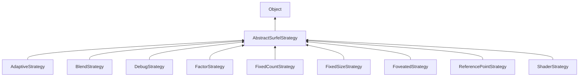

#### Inheritance Graph

## Functions

|
| ---------------------------------------------------------------------------------------------------------------------------------------------------------------: | -- | 
| **[isEnabled](classMinSG_1_1BlueSurfels_1_1AbstractSurfelStrategy#classMinSG_1_1BlueSurfels_1_1AbstractSurfelStrategy_1af72a28b486ab513f701a55de975e15a9)**()    |  | 
| **[setEnabled](classMinSG_1_1BlueSurfels_1_1AbstractSurfelStrategy#classMinSG_1_1BlueSurfels_1_1AbstractSurfelStrategy_1a64bf9c0f2eecd581d8dec76a4b32f0f6)**(p0) |  | 
{: .nohead .nowrap1 }

