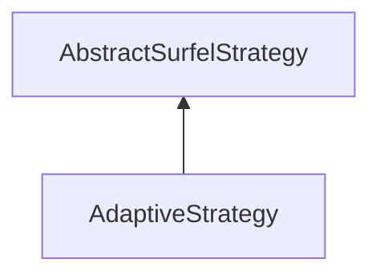

#### Inheritance Graph

## Functions

|
| --------------------: | --------------------------- | 
| **_constructor**()    | [ESMF] new AdaptiveStrategy | 
| **getMaxSize**()      |                             | 
| **getTargetTime**()   |                             | 
| **setMaxSize**(p0)    |                             | 
| **setTargetTime**(p0) |                             | 
{: .nohead .nowrap1 }

