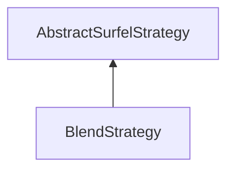

#### Inheritance Graph

## Functions

|
| -----------------: | ------------------------ | 
| **_constructor**() | [ESMF] new BlendStrategy | 
| **getBlend**()     |                          | 
| **setBlend**(p0)   |                          | 
{: .nohead .nowrap1 }

