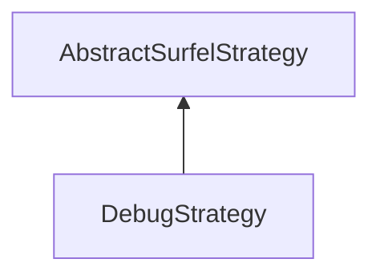

#### Inheritance Graph

## Functions

|
| ------------------------------------------------------------------------------------------------------------------------------------------------: | ------------------------ | 
| **_constructor**()                                                                                                                                | [ESMF] new DebugStrategy | 
| **getDebugColorScreen**()                                                                                                                         |                          | 
| **[getFixSurfels](classMinSG_1_1BlueSurfels_1_1DebugStrategy#classMinSG_1_1BlueSurfels_1_1DebugStrategy_1a507088cd98467dfccaf2f222ecb1a841)**()   |                          | 
| **[getHeatmap](classMinSG_1_1BlueSurfels_1_1DebugStrategy#classMinSG_1_1BlueSurfels_1_1DebugStrategy_1ae86fecedfe536338fa78cd2afe1534da)**()      |                          | 
| **getHideSurfels**()                                                                                                                              |                          | 
| **setDebugColorScreen**(p0)                                                                                                                       |                          | 
| **[setFixSurfels](classMinSG_1_1BlueSurfels_1_1DebugStrategy#classMinSG_1_1BlueSurfels_1_1DebugStrategy_1a9bad476421b2bc6f79fbfe78cd942191)**(p0) |                          | 
| **[setHeatmap](classMinSG_1_1BlueSurfels_1_1DebugStrategy#classMinSG_1_1BlueSurfels_1_1DebugStrategy_1a96fa175b04441d9c69b11bbbac614911)**(p0)    |                          | 
| **setHideSurfels**(p0)                                                                                                                            |                          | 
{: .nohead .nowrap1 }

