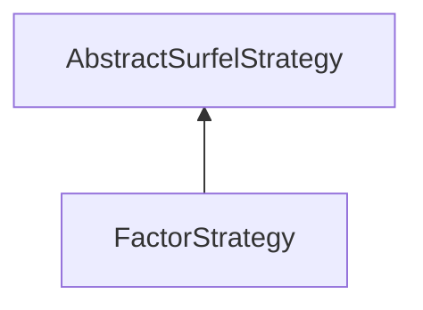

#### Inheritance Graph

## Functions

|
| ---------------------: | ------------------------- | 
| **_constructor**()     | [ESMF] new FactorStrategy | 
| **getCountFactor**()   |                           | 
| **getSizeFactor**()    |                           | 
| **setCountFactor**(p0) |                           | 
| **setSizeFactor**(p0)  |                           | 
{: .nohead .nowrap1 }

