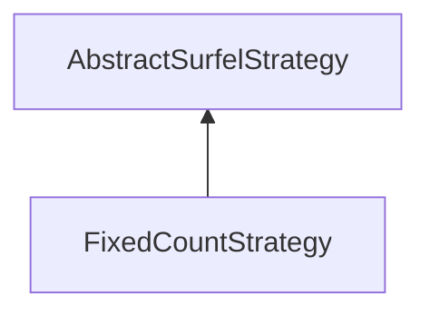

#### Inheritance Graph

## Functions

|
| -----------------: | ----------------------------- | 
| **_constructor**() | [ESMF] new FixedCountStrategy | 
| **getCount**()     |                               | 
| **setCount**(p0)   |                               | 
{: .nohead .nowrap1 }

