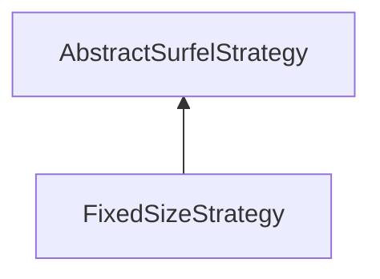

#### Inheritance Graph

## Functions

|
| -----------------: | ---------------------------- | 
| **_constructor**() | [ESMF] new FixedSizeStrategy | 
| **getSize**()      |                              | 
| **setSize**(p0)    |                              | 
{: .nohead .nowrap1 }

