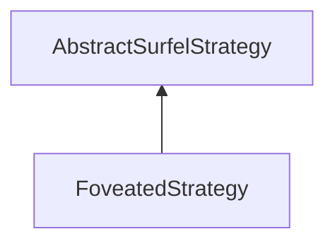

#### Inheritance Graph

## Functions

|
| ------------------------------------------------------------------------------------------------------------------------------------------------------: | --------------------------------------------------- | 
| **_constructor**()                                                                                                                                      | [ESMF] new FoveatedStrategy                         | 
| **getDebug**()                                                                                                                                          |                                                     | 
| **[getFoveaZones](classMinSG_1_1BlueSurfels_1_1FoveatedStrategy#classMinSG_1_1BlueSurfels_1_1FoveatedStrategy_1a82894063228651f36cd5b44043fbb424)**()   | [ESMF] Bool FoveatedStrategy.getFoveaZones()        | 
| **getOffset**()                                                                                                                                         |                                                     | 
| **setDebug**(p0)                                                                                                                                        |                                                     | 
| **[setFoveaZones](classMinSG_1_1BlueSurfels_1_1FoveatedStrategy#classMinSG_1_1BlueSurfels_1_1FoveatedStrategy_1a63d424e6543baf0bc21f197b4fb24ccb)**(p0) | [ESMF] self FoveatedStrategy.setFoveaZones( Array ) | 
| **setOffset**(p0)                                                                                                                                       |                                                     | 
{: .nohead .nowrap1 }

