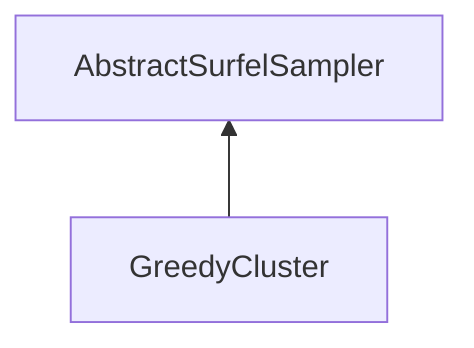

#### Inheritance Graph

## Functions

|
| -----------------------------------------------------------------------------------------------------------------------------------------------: | ------------------------ | 
| **_constructor**()                                                                                                                               | [ESMF] new GreedyCluster | 
| **[getMinRadius](classMinSG_1_1BlueSurfels_1_1GreedyCluster#classMinSG_1_1BlueSurfels_1_1GreedyCluster_1aef9dc92d6a05880ab2171f6bb3bf8464)**()   |                          | 
| **[getSampleTimes](classMinSG_1_1BlueSurfels_1_1GreedyCluster#classMinSG_1_1BlueSurfels_1_1GreedyCluster_1a75755b2de77d88ffb01ed6b61eaa6939)**() |                          | 
| **[setMinRadius](classMinSG_1_1BlueSurfels_1_1GreedyCluster#classMinSG_1_1BlueSurfels_1_1GreedyCluster_1a904189ac2b52125e0c35acbfb2402633)**(p0) |                          | 
{: .nohead .nowrap1 }

