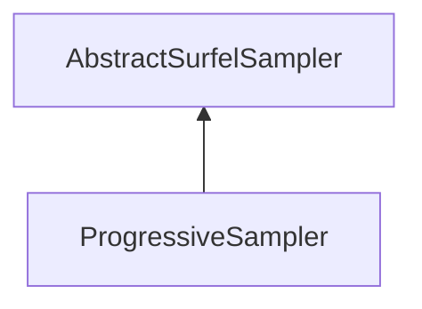

#### Inheritance Graph

## Functions

|
| ---------------------------------------------------------------------------------------------------------------------------------------------------------------: | ----------------------------- | 
| **_constructor**()                                                                                                                                               | [ESMF] new ProgressiveSampler | 
| **[getSamplesPerRound](classMinSG_1_1BlueSurfels_1_1ProgressiveSampler#classMinSG_1_1BlueSurfels_1_1ProgressiveSampler_1afb254d8fd3b361e2eec7805b378d05c1)**()   |                               | 
| **[setSamplesPerRound](classMinSG_1_1BlueSurfels_1_1ProgressiveSampler#classMinSG_1_1BlueSurfels_1_1ProgressiveSampler_1ab290f820a0b02bb67c4d9cae70708582)**(p0) |                               | 
{: .nohead .nowrap1 }

