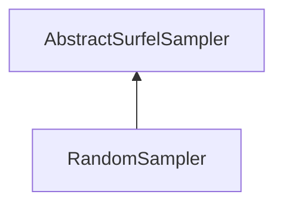

#### Inheritance Graph

```mermaid
graph BT
	RandomSampler
	RandomSampler --> AbstractSurfelSampler
	click RandomSampler "escript_type_MinSG_BlueSurfels_RandomSampler"
	click AbstractSurfelSampler "escript_type_MinSG_BlueSurfels_AbstractSurfelSampler"
```

## Functions

|
| -----------------: | ------------------------ | 
| **_constructor**() | [ESMF] new RandomSampler | 
{: .nohead .nowrap1 }

