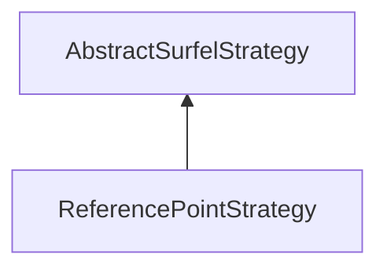

#### Inheritance Graph

## Functions

|
| ------------------------: | ----------------------------- | 
| **_constructor**()        | [ESMF] new FixedCountStrategy | 
| **getReferencePoint**()   |                               | 
| **setReferencePoint**(p0) |                               | 
{: .nohead .nowrap1 }

