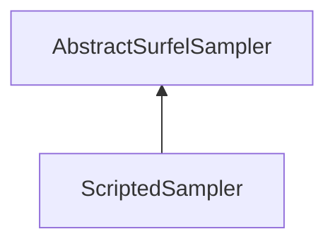

#### Inheritance Graph

## Functions

|
| ----------------------: | ----------------------------------------------------------------------- | 
| **_constructor**()      | [ESMF] new ScriptedSampler                                              | 
| **doSampleSurfels**(p0) | [ESMF] void ScriptedSampler.doSampleSurfels(Mesh) \note ObjectAttribute | 
{: .nohead .nowrap1 }

