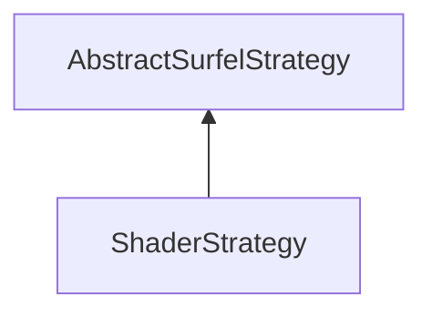

#### Inheritance Graph

## Functions

|
| -----------------------------------------------------------------------------------------------------------------------------------------------------: | ------------------------- | 
| **_constructor**()                                                                                                                                     | [ESMF] new ShaderStrategy | 
| **[addSearchPath](classUtil_1_1FileLocator#classUtil_1_1FileLocator_1ab773e13a5668dfb510a944e654570118)**(p0)                                          |                           | 
| **getShaderFS**()                                                                                                                                      |                           | 
| **getShaderGS**()                                                                                                                                      |                           | 
| **getShaderVS**()                                                                                                                                      |                           | 
| **[getSurfelCulling](classMinSG_1_1BlueSurfels_1_1ShaderStrategy#classMinSG_1_1BlueSurfels_1_1ShaderStrategy_1ab247b467346a0daa1e159338e67cf637)**()   |                           | 
| **[getSurfelDynSize](classMinSG_1_1BlueSurfels_1_1ShaderStrategy#classMinSG_1_1BlueSurfels_1_1ShaderStrategy_1a1d4e7a7ed18ad3f2ddd1cb7eb0c067f9)**()   |                           | 
| **[refreshShader](classMinSG_1_1BlueSurfels_1_1ShaderStrategy#classMinSG_1_1BlueSurfels_1_1ShaderStrategy_1ae792309e7d344abee2f1f488c08c8f8f)**()      |                           | 
| **setShaderFS**(p0)                                                                                                                                    |                           | 
| **setShaderGS**(p0)                                                                                                                                    |                           | 
| **setShaderVS**(p0)                                                                                                                                    |                           | 
| **[setSurfelCulling](classMinSG_1_1BlueSurfels_1_1ShaderStrategy#classMinSG_1_1BlueSurfels_1_1ShaderStrategy_1a668108463bcdb5c4868210a11297479d)**(p0) |                           | 
| **[setSurfelDynSize](classMinSG_1_1BlueSurfels_1_1ShaderStrategy#classMinSG_1_1BlueSurfels_1_1ShaderStrategy_1addb51d45f3b6fe720340bb3d23c600ab)**(p0) |                           | 
{: .nohead .nowrap1 }

