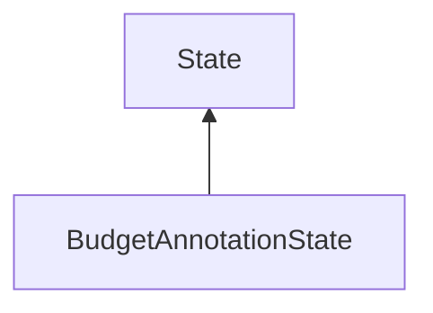

#### Inheritance Graph

## Attributes

|
| ------------------------------------------------: | -- | 
| **DISTRIBUTE_DELETE**                             |  | 
| **DISTRIBUTE_EVEN**                               |  | 
| **DISTRIBUTE_PROJECTED_SIZE**                     |  | 
| **DISTRIBUTE_PROJECTED_SIZE_AND_PRIMITIVE_COUNT** |  | 
{: .nohead .nowrap1 }

## Functions

|
| -------------------------------------------------------------------------------------------------------------------------------------------: | ---------------------------------------------------------------- | 
| **_constructor**()                                                                                                                           | [ESF] new BudgetAnnotationState()                                | 
| **[getAnnotationAttribute](classMinSG_1_1BudgetAnnotationState#classMinSG_1_1BudgetAnnotationState_1a9afc38dbd7d5be7dc65e6286728dcf08)**()   | [ESMF] String BudgetAnnotationState.getAnnotationAttribute()     | 
| **[getBudget](classMinSG_1_1BudgetAnnotationState#classMinSG_1_1BudgetAnnotationState_1a99ab5cb4cf5d6e8d147747954cc5a99d)**()                | [ESMF] Number BudgetAnnotationState.getBudget()                  | 
| **[getDistributionType](classMinSG_1_1BudgetAnnotationState#classMinSG_1_1BudgetAnnotationState_1a9df4c42c980aac855fa1eec0e759f523)**()      | [ESMF] Number BudgetAnnotationState.getDistributionType()        | 
| **[setAnnotationAttribute](classMinSG_1_1BudgetAnnotationState#classMinSG_1_1BudgetAnnotationState_1a99773bc88de0906b5d473f30b4ecdd69)**(p0) | [ESMF] self BudgetAnnotationState.setAnnotationAttribute(String) | 
| **[setBudget](classMinSG_1_1BudgetAnnotationState#classMinSG_1_1BudgetAnnotationState_1ad73a74518db04abed6f81dc760aea320)**(p0)              | [ESMF] self BudgetAnnotationState.setBudget(Number)              | 
| **[setDistributionType](classMinSG_1_1BudgetAnnotationState#classMinSG_1_1BudgetAnnotationState_1ad022908f408a3a46c27c299c294fe889)**(p0)    | [ESMF] self BudgetAnnotationState.setDistributionType(Number)    | 
{: .nohead .nowrap1 }

