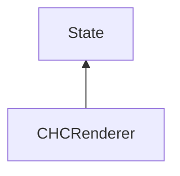

#### Inheritance Graph

## Functions

|
| --------------------------------------------------------------------------------------------------------------------: | -------------------------------------------- | 
| **_constructor**()                                                                                                    | [ESMF] new MinSG.CHCRenderer                 | 
| **[getDebugShowVisible](classMinSG_1_1CHCRenderer#classMinSG_1_1CHCRenderer_1a1e256ca62ce8cfda4ffe8c40b415dd9a)**()   | [ESMF] enum MinSG.getMode()	                 | 
| **[setDebugShowVisible](classMinSG_1_1CHCRenderer#classMinSG_1_1CHCRenderer_1ad6af8d9281619a522028e2435049518e)**(p0) | [ESMF] self MinSG.setDebugShowVisible(bool)	 | 
{: .nohead .nowrap1 }

