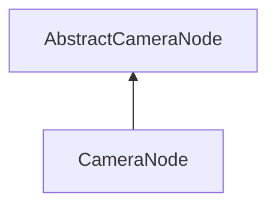

#### Inheritance Graph

## Functions

|
| -----------------------------------------------------------------------------------------------------------------------------: | ------------------------------------------------------------------------- | 
| **_constructor**([p0 [, p1 [, p2 [, p3]]]])                                                                                    | [ESMF] new MinSG.CameraNode([angle,[ratio,[near,[far]]]])                 | 
| **[applyHorizontalAngle](classMinSG_1_1CameraNode#classMinSG_1_1CameraNode_1afec31e94d500a0cd6a2ad0a51b799fe4)**(p0)           | [ESMF] self MinSG.Camera.applyHorizontalAngle(number a)                   | 
| **[applyVerticalAngle](classMinSG_1_1CameraNode#classMinSG_1_1CameraNode_1ac7b8a45e680bf71293bcbce459b432a5)**(p0)             | [ESMF] self MinSG.Camera.applyVerticalAngle(number a)                     | 
| **[getAngles](classMinSG_1_1CameraNode#classMinSG_1_1CameraNode_1ae6c3f5c344d6071159e8198ac8113029)**()                        | [ESMF] Array cam.getAngles(  )                                            | 
| **[setAngles](classMinSG_1_1CameraNode#classMinSG_1_1CameraNode_1acb4a799ad73f68bdddc90105b1405bd2)**(p0 [, p1 [, p2 [, p3]]]) | [ESMF] self cam.setAngles( array[4] \| fovLeft,fovRight,fovBottom,fovTop) | 
{: .nohead .nowrap1 }

