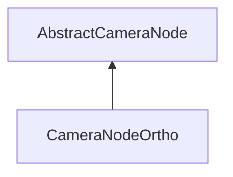

#### Inheritance Graph

## Functions

|
| --------------------------------------------------------------------------------------------------------------------------------------: | ----------------------------------------------------------------------------------- | 
| **_constructor**([p0 [, p1]])                                                                                                           | [ESMF] new MinSG.CameraNodeOrtho([near=1,[far=10000]])                              | 
| **[getBottomClippingPlane](classMinSG_1_1CameraNodeOrtho#classMinSG_1_1CameraNodeOrtho_1af3ab6709f647b1efb4cf983c6e8b7146)**()          | [ESMF] Number MinSG.CameraNodeOrtho.getBottomClippingPlane()                        | 
| **[getLeftClippingPlane](classMinSG_1_1CameraNodeOrtho#classMinSG_1_1CameraNodeOrtho_1a5a5f87c44160edcaaf17adbb779c82ac)**()            | [ESMF] Number MinSG.CameraNodeOrtho.getLeftClippingPlane()                          | 
| **[getRightClippingPlane](classMinSG_1_1CameraNodeOrtho#classMinSG_1_1CameraNodeOrtho_1a2704d23c5f6c27aefd4be53ba1a4956b)**()           | [ESMF] Number MinSG.CameraNodeOrtho.getRightClippingPlane()                         | 
| **[getTopClippingPlane](classMinSG_1_1CameraNodeOrtho#classMinSG_1_1CameraNodeOrtho_1a02e4f605e799ae843c5650b8c5c3f15b)**()             | [ESMF] Number MinSG.CameraNodeOrtho.getTopClippingPlane()                           | 
| **[setBottomClippingPlane](classMinSG_1_1CameraNodeOrtho#classMinSG_1_1CameraNodeOrtho_1a14c911bd7cf6c1b34b72ff3a3c0dc28f)**(p0)        | [ESMF] self MinSG.CameraNodeOrtho.setBottomClippingPlane(Number)                    | 
| **[setClippingPlanes](classMinSG_1_1CameraNodeOrtho#classMinSG_1_1CameraNodeOrtho_1afc61da8204de799d381e7679dd47398d)**(p0, p1, p2, p3) | [ESMF] self MinSG.CameraNodeOrtho.setClippingPlanes(Number, Number, Number, Number) | 
| **[setFrustumFromScaledViewport](classMinSG_1_1CameraNodeOrtho#classMinSG_1_1CameraNodeOrtho_1a1a87a52d8433fb3d7e16758586f34b86)**(p0)  | [ESMF] self MinSG.CameraNodeOrtho.setFrustumFromScaledViewport(Number)              | 
| **[setLeftClippingPlane](classMinSG_1_1CameraNodeOrtho#classMinSG_1_1CameraNodeOrtho_1ac33820833ccfcae0117fa3ecf3b1712e)**(p0)          | [ESMF] self MinSG.CameraNodeOrtho.setLeftClippingPlane(Number)                      | 
| **[setRightClippingPlane](classMinSG_1_1CameraNodeOrtho#classMinSG_1_1CameraNodeOrtho_1a57b1e92e2a6390a76ad52f92690539e6)**(p0)         | [ESMF] self MinSG.CameraNodeOrtho.setRightClippingPlane(Number)                     | 
| **[setTopClippingPlane](classMinSG_1_1CameraNodeOrtho#classMinSG_1_1CameraNodeOrtho_1a67a615839f7b3243309a7ae117c68edc)**(p0)           | [ESMF] self MinSG.CameraNodeOrtho.setTopClippingPlane(Number)                       | 
{: .nohead .nowrap1 }

