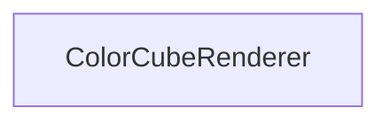

#### Inheritance Graph

## Functions

|
| --------------------------------------------------------------------------------------------------------------------------------: | ------------------------------------------------------- | 
| **_constructor**()                                                                                                                | [ESMF] new MinSG.ColorCubeRenderer()                    | 
| **[isHighlightEnabled](classMinSG_1_1ColorCubeRenderer#classMinSG_1_1ColorCubeRenderer_1a9b854882f6e96609be966afc12961ed2)**()    | [ESMF] Bool ColorCubeRenderer.isHighlightEnabled()      | 
| **[setHighlightEnabled](classMinSG_1_1ColorCubeRenderer#classMinSG_1_1ColorCubeRenderer_1ae426b6583aea24401a96af0f5a14d390)**(p0) | [ESMF] self ColorCubeRenderer.setHighlightEnabled(bool) | 
{: .nohead .nowrap1 }

