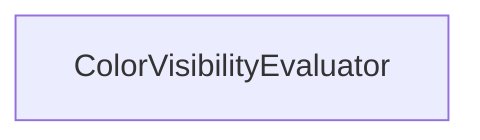

#### Inheritance Graph

## Functions

|
| ---------------------: | ----------------------------------------------------------------------------------- | 
| **_constructor**([p0]) | [ESMF] ColorVisibilityEvaluator new ColorVisibilityEvaluator([mode = SINGLE_VALUE]) | 
{: .nohead .nowrap1 }

