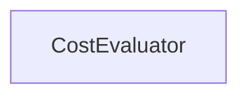

#### Inheritance Graph

## Functions

|
| -------------------: | ---------------------------------------------- | 
| **_constructor**(p0) | [ESMF] CostEvaluator new CostEvaluator(Number) | 
{: .nohead .nowrap1 }

