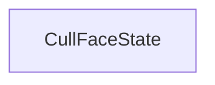

#### Inheritance Graph

## Functions

|
| ------------------------: | ----------------------------------------------------- | 
| **_constructor**()        | [ESMF] CullFaceState new MinSG.CullFaceState( )       | 
| **getCullMode**()         | [ESMF] number CullFaceState.getCullMode()             | 
| **getCullingEnabled**()   | [ESMF] thisEObj CullFaceState.getCullingEnabled()     | 
| **setCullMode**(p0)       | [ESMF] thisEObj CullFaceState.setCullMode(Number)     | 
| **setCullingEnabled**(p0) | [ESMF] thisEObj CullFaceState.setCullingEnabled(Bool) | 
{: .nohead .nowrap1 }

