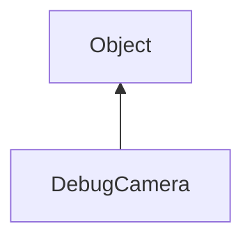

#### Inheritance Graph

## Functions

|
| -------------------------------------------------------------------------------------------------------------------: | ------------------------------------------- | 
| **_constructor**()                                                                                                   | [ESF] new DebugCamera                       | 
| **[disable](classMinSG_1_1DebugCamera#classMinSG_1_1DebugCamera_1ac856b6ec93f29d2a7f01aa4a95133dd1)**(p0)            | [ESMF] self DebugCamera.disable(p0)         | 
| **[enable](classMinSG_1_1DebugCamera#classMinSG_1_1DebugCamera_1a8715724e205c6275d405596b314fb0c8)**(p0, p1, p2, p3) | [ESMF] self DebugCamera.enable(p0,p1,p2,p3) | 
{: .nohead .nowrap1 }

