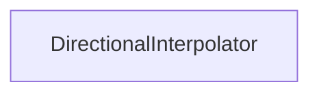

#### Inheritance Graph

## Functions

|
| ------------------------------------------------------------------------------------------------------------------------------------------------------: | -------------------------------------------------------------------------------------------------------------- | 
| **_constructor**()                                                                                                                                      | [ESMF] DirectionalInterpolation new DirectionalInterpolation()                                                 | 
| **[calculateValue](classMinSG_1_1DirectionalInterpolator#classMinSG_1_1DirectionalInterpolator_1aa1711dcf9edfeeebba6665bbd3c74606)**(p0, p1, p2 [, p3]) | [ESMF] mixed new calculateValue(RenderingContext, ValuatedRegionNode,camera[,measurementApertureAngle_deg=90]) | 
{: .nohead .nowrap1 }

