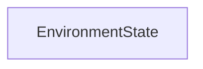

#### Inheritance Graph

## Functions

|
| -------------------------------------------------------------------------------------------------------------------------: | ---------------------------------------------------------- | 
| **_constructor**()                                                                                                         | [ESMF] new MinSG.EnvironmentState()                        | 
| **[getEnvironment](classMinSG_1_1EnvironmentState#classMinSG_1_1EnvironmentState_1a2e6452355a07b22dc18fef60ac3f29e0)**()   | [ESMF] Node MinSG.EnvironmentState.getEnvironment()        | 
| **[setEnvironment](classMinSG_1_1EnvironmentState#classMinSG_1_1EnvironmentState_1ae022625f4a74f0e4517ffa5e533c53a1)**(p0) | [ESMF] self MinSG.EnvironmentState.setEnvironment(Node)    | 
{: .nohead .nowrap1 }

