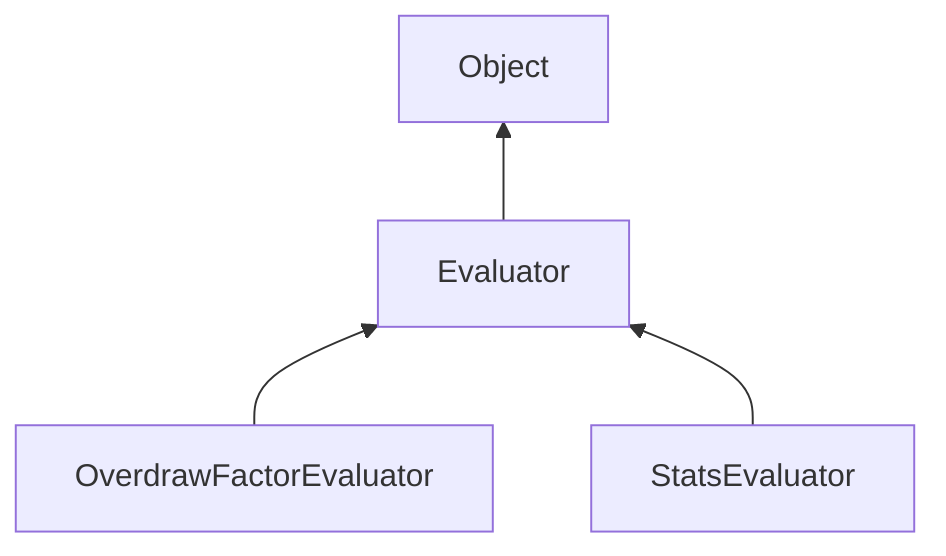

#### Inheritance Graph

## Attributes

|
| -------------------: | -- | 
| **DIRECTION_VALUES** |  | 
| **SINGLE_VALUE**     |  | 
{: .nohead .nowrap1 }

## Functions

|
| ----------------------------------------------------------------------------------------------------------------------------------------: | ------------------------------------------------------------- | 
| **[beginMeasure](classMinSG_1_1Evaluators_1_1Evaluator#classMinSG_1_1Evaluators_1_1Evaluator_1a3c81d34e6e3a89baaae0f74135d7c12d)**()      | [ESMF] self Evaluator.beginMeasure()                          | 
| **[endMeasure](classMinSG_1_1Evaluators_1_1Evaluator#classMinSG_1_1Evaluators_1_1Evaluator_1a05a0088a456e30f79721680a6a098303)**(p0)      | [ESMF] self Evaluator.endMeasure(FrameContext)                | 
| **[getMaxValue](classMinSG_1_1Evaluators_1_1Evaluator#classMinSG_1_1Evaluators_1_1Evaluator_1a02ddd0514615e26d401d07cb4b77f28a)**()       | [ESMF] number Evaluator.getMaxValue()                         | 
| **[getMode](classMinSG_1_1Evaluators_1_1Evaluator#classMinSG_1_1Evaluators_1_1Evaluator_1aa6bf058d7348c74d78aed375a4f62c5f)**()           | [ESMF] number Evaluator.getMode()                             | 
| **[getResults](classMinSG_1_1Evaluators_1_1Evaluator#classMinSG_1_1Evaluators_1_1Evaluator_1ac7fa9e9ec6797e23a4b18c5db7bd8595)**()        | [ESMF] Array Evaluator.getResults()                           | 
| **[measure](classMinSG_1_1Evaluators_1_1Evaluator#classMinSG_1_1Evaluators_1_1Evaluator_1aa8ceeae0c0e580c0e1ee0666ab6445e0)**(p0, p1, p2) | [ESMF] self Evaluator.measure(FrameContext,Node,Rect)         | 
| **[setMode](classMinSG_1_1Evaluators_1_1Evaluator#classMinSG_1_1Evaluators_1_1Evaluator_1acd8172ac4fbba1f5d735de6fdb413035)**(p0)         | [ESMF] self Evaluator.setMode(SINGLE_VALUE\|DIRECTION_VALUES) | 
{: .nohead .nowrap1 }

