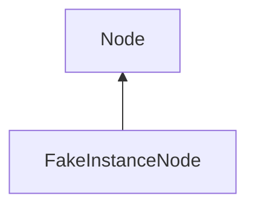

#### Inheritance Graph

## Functions

|
| ---------------------------------------------------------------------------------------------------------------------------: | --------------------------------------------------- | 
| **_constructor**()                                                                                                           | [ESF] new MinSG.FakeInstanceNode()                  | 
| **[getFakePrototype](classMinSG_1_1FakeInstanceNode#classMinSG_1_1FakeInstanceNode_1a7caf26d8f0604a0d0cec76ae73f06abe)**()   | [ESMF] Node FakeInstanceNode.getFakePrototype()     | 
| **[setFakePrototype](classMinSG_1_1FakeInstanceNode#classMinSG_1_1FakeInstanceNode_1a9d38f17484cc7e325aafea270cef22c2)**(p0) | [ESMF] self FakeInstanceNode.setFakePrototype(Node) | 
{: .nohead .nowrap1 }

