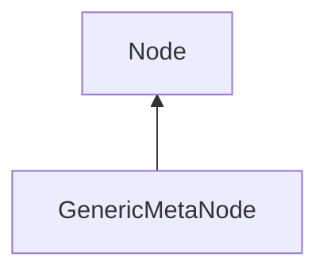

#### Inheritance Graph

## Functions

|
| --------------------------------------------------------------------------------------------------------------: | ------------------------------------------------- | 
| **_constructor**()                                                                                              | [ESF] new MinSG.GenericMetaNode()                 | 
| **[setBB](classMinSG_1_1GenericMetaNode#classMinSG_1_1GenericMetaNode_1aed8f98e28af8490c8393a21221a351ea)**(p0) | [ESMF] self genericMetaNode.setBB( Geometry.Box ) | 
{: .nohead .nowrap1 }

