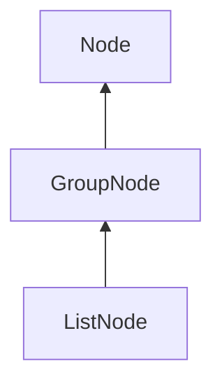

#### Inheritance Graph

## Functions

|
| --------------------------------------------------------------------------------------------------------: | -------------------------------------------------- | 
| **_constructor**([p0])                                                                                    | [ESMF] new GroupNode([string name])                | 
| **[addChild](classMinSG_1_1GroupNode#classMinSG_1_1GroupNode_1afb7cb09c8a0168b4f76649e51df21670)**(p0)    | [ESMF] self GroupNode.addChild(MinSGNode child)    | 
| **[countChildren](classMinSG_1_1GroupNode#classMinSG_1_1GroupNode_1a769304f75957d72d673ff9e4ae01e751)**() | [ESMF] Number GroupNode.countChildren()            | 
| **[removeChild](classMinSG_1_1GroupNode#classMinSG_1_1GroupNode_1abf988f31706682687afacbeab5f6e91b)**(p0) | [ESMF] self GroupNode.removeChild(MinSGNode child) | 
{: .nohead .nowrap1 }

