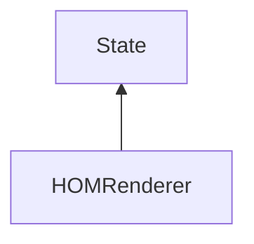

#### Inheritance Graph

## Functions

|
| -------------------------------------------------------------------------------------------------------------------------: | -------------------------------------------------------- | 
| **_constructor**([p0])                                                                                                     | [ESF] new MinSG.HOMRenderer([Number])                    | 
| **[getMaxOccluderComplexity](classMinSG_1_1HOMRenderer#classMinSG_1_1HOMRenderer_1a7bff424002701e6b680d17f2a9109d0d)**()   | [ESMF] Number HOMRenderer.getMaxOccluderComplexity()     | 
| **[getMaxOccluderDepth](classMinSG_1_1HOMRenderer#classMinSG_1_1HOMRenderer_1a9298e5ed6cef118521168e441b893604)**()        | [ESMF] Number HOMRenderer.getMaxOccluderDepth()          | 
| **[getMinOccluderSize](classMinSG_1_1HOMRenderer#classMinSG_1_1HOMRenderer_1a8438e1ac0dabca04125dc8cd8089c45c)**()         | [ESMF] Number HOMRenderer.getMinOccluderSize()           | 
| **[getShowCulledGeometry](classMinSG_1_1HOMRenderer#classMinSG_1_1HOMRenderer_1a39b0fdffe69a6da9ab9503102e7e9e94)**()      | [ESMF] Bool HOMRenderer.getShowCulledGeometry()          | 
| **[getShowHOMPyramid](classMinSG_1_1HOMRenderer#classMinSG_1_1HOMRenderer_1adea7068bcc7a32e910d39cf6963b51bd)**()          | [ESMF] Bool HOMRenderer.getShowHOMPyramid()              | 
| **[getShowOnlyOccluders](classMinSG_1_1HOMRenderer#classMinSG_1_1HOMRenderer_1a126d4bd8389267143564e2649f2fe3b7)**()       | [ESMF] Bool HOMRenderer.getShowOnlyOccluders()           | 
| **[getSideLength](classMinSG_1_1HOMRenderer#classMinSG_1_1HOMRenderer_1a5053503e53d52ba56a69bfd0e6d2ba48)**()              | [ESMF] Number HOMRenderer.getSideLength()                | 
| **[getTriangleLimit](classMinSG_1_1HOMRenderer#classMinSG_1_1HOMRenderer_1aee806ba473877fbc057fdfd06568430a)**()           | [ESMF] Number HOMRenderer.getTriangleLimit()             | 
| **[initOccluderDatabase](classMinSG_1_1HOMRenderer#classMinSG_1_1HOMRenderer_1abe467adcb93175bcf12ab39caf946f94)**()       | [ESMF] Void HOMRenderer.initOccluderDatabase()           | 
| **[setMaxOccluderComplexity](classMinSG_1_1HOMRenderer#classMinSG_1_1HOMRenderer_1a6a1989fc13004c8d70d9cd65c97df914)**(p0) | [ESMF] Void HOMRenderer.setMaxOccluderComplexity(Number) | 
| **[setMaxOccluderDepth](classMinSG_1_1HOMRenderer#classMinSG_1_1HOMRenderer_1acee928feddb1b3410b771065be4488ae)**(p0)      | [ESMF] Void HOMRenderer.setMaxOccluderDepth(Number)      | 
| **[setMinOccluderSize](classMinSG_1_1HOMRenderer#classMinSG_1_1HOMRenderer_1a97df6a257bb2af2bebe2f9c77bc7050d)**(p0)       | [ESMF] Void HOMRenderer.setMinOccluderSize(Number)       | 
| **[setShowCulledGeometry](classMinSG_1_1HOMRenderer#classMinSG_1_1HOMRenderer_1a94942cfa8b55b4dc183df61bf3c8fe19)**(p0)    | [ESMF] Void HOMRenderer.setShowCulledGeometry(Bool)      | 
| **[setShowHOMPyramid](classMinSG_1_1HOMRenderer#classMinSG_1_1HOMRenderer_1aa98360e43602107ae15c321b852026f6)**(p0)        | [ESMF] Void HOMRenderer.setShowHOMPyramid(Bool)          | 
| **[setShowOnlyOccluders](classMinSG_1_1HOMRenderer#classMinSG_1_1HOMRenderer_1a2903fb913733633479e5c639b3ba41cd)**(p0)     | [ESMF] Void HOMRenderer.setShowOnlyOccluders(Bool)       | 
| **[setSideLength](classMinSG_1_1HOMRenderer#classMinSG_1_1HOMRenderer_1a9c63b4bcb5c15947b0e482bd246937b6)**(p0)            | [ESMF] Void HOMRenderer.setSideLength(Number)            | 
| **[setTriangleLimit](classMinSG_1_1HOMRenderer#classMinSG_1_1HOMRenderer_1aa87c53172df06610d804eb04df3e8494)**(p0)         | [ESMF] Void HOMRenderer.setTriangleLimit(Number)         | 
{: .nohead .nowrap1 }

