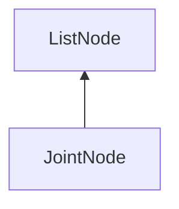

#### Inheritance Graph

## Functions

|
| -----------------------------------------------------------------------------------------------------------------------: | --------------------------------------- | 
| **_constructor**(p0, p1)                                                                                                 | [ESMF] new MinSG.JointNode( id, name )	 | 
| **[getId](classMinSG_1_1AbstractJoint#classMinSG_1_1AbstractJoint_1a4aadfddb57cd516a49321600df9a9605)**()                |                                         | 
| **[getInverseBindMatrix](classMinSG_1_1AbstractJoint#classMinSG_1_1AbstractJoint_1ab8a7619d0f9bf5077be10144895c12a6)**() |                                         | 
| **[getName](classMinSG_1_1AbstractJoint#classMinSG_1_1AbstractJoint_1afa617ed8801b14b4ef5e8682b5de5d2d)**()              |                                         | 
| **[setBindMatrix](classMinSG_1_1AbstractJoint#classMinSG_1_1AbstractJoint_1a1b9a508e924eddec009945baa4b82496)**()        |                                         | 
{: .nohead .nowrap1 }

