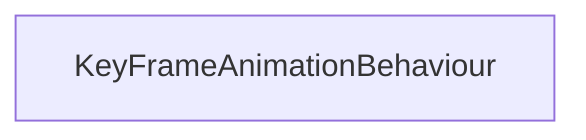

#### Inheritance Graph

## Functions

|
| -------------------: | ----------------------------------------------------------------------- | 
| **_constructor**(p0) | [ESMF] new MinSG.KeyFrameAnimationBehaviour(E_KeyFrameAnimationNode  )	 | 
{: .nohead .nowrap1 }

