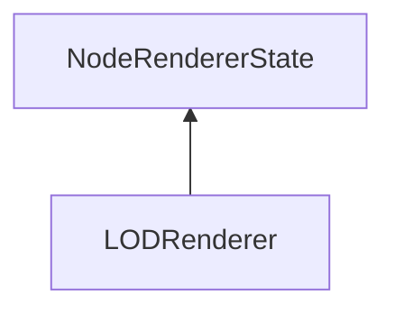

#### Inheritance Graph

## Functions

|
| ---------------------------------------------------------------------------------------------------------------------: | -- | 
| **_constructor**()                                                                                                     |  | 
| **[generateLODsRecursiv](classMinSG_1_1LODRenderer#classMinSG_1_1LODRenderer_1ac2950cef01ed418188345bfb2d07e5a1)**(p0) |  | 
| **[getMaxComplexity](classMinSG_1_1LODRenderer#classMinSG_1_1LODRenderer_1a715a1e584130570c1b62dc0dca34ebb1)**()       |  | 
| **[getMinComplexity](classMinSG_1_1LODRenderer#classMinSG_1_1LODRenderer_1ad9490c3b29c31f9c6360fb2dbfde3478)**()       |  | 
| **[getRelComplexity](classMinSG_1_1LODRenderer#classMinSG_1_1LODRenderer_1aebe0b59ab28d0aec714f49d8a12870b4)**()       |  | 
| **[setMaxComplexity](classMinSG_1_1LODRenderer#classMinSG_1_1LODRenderer_1a669f7d05edd2d11bbe71ba9c925f5f05)**(p0)     |  | 
| **[setMinComplexity](classMinSG_1_1LODRenderer#classMinSG_1_1LODRenderer_1ac41933de2a73873918fc646d86e0c2a5)**(p0)     |  | 
| **[setRelComplexity](classMinSG_1_1LODRenderer#classMinSG_1_1LODRenderer_1ab146fafe078bd4c20a826f121e753186)**(p0)     |  | 
{: .nohead .nowrap1 }

