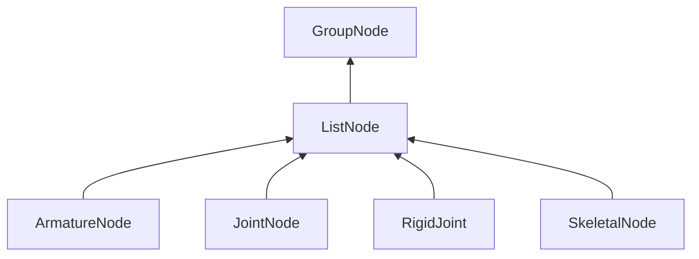

#### Inheritance Graph

## Functions

|
| ---------------------------------------------------------------------------------------------------: | ---------------------------------------------------------- | 
| **_constructor**()                                                                                   | [ESMF] new MinSG.E_ListNode()                              | 
| **[getChild](classMinSG_1_1ListNode#classMinSG_1_1ListNode_1aaa0b6ef039fa53ff44bf90f572d83307)**(p0) | [ESMF] MinSG.Node\|void MinSG.ListNode.getChild(int index) | 
{: .nohead .nowrap1 }

