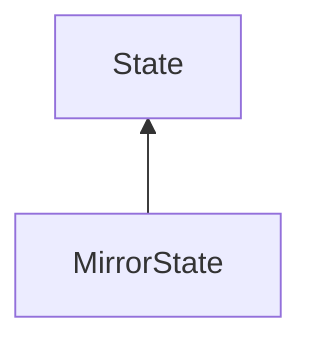

#### Inheritance Graph

## Functions

|
| --------------------------------------------------------------------------------------------------------: | ------------------------------------------------------ | 
| **_constructor**(p0)                                                                                      | [ESMF] MirrorState new MirrorState(Number textureSize) | 
| **[setRoot](classMinSG_1_1MirrorState#classMinSG_1_1MirrorState_1aceedb5d4c8122650be4aeb90c17b5c15)**(p0) | [ESMF] self MirrorState.setRoot(Node)                  | 
{: .nohead .nowrap1 }

