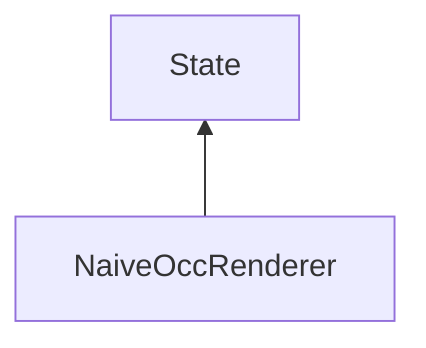

#### Inheritance Graph

## Functions

|
| ------------------------------------------------------------------------------------------------------------------------------: | -------------------------------------------- | 
| **_constructor**()                                                                                                              | [ESMF] new MinSG.NaiveOccRenderer            | 
| **[getDebugShowVisible](classMinSG_1_1NaiveOccRenderer#classMinSG_1_1NaiveOccRenderer_1a0f4053987eb3246c851ad4e5c2206ce3)**()   | [ESMF] enum MinSG.getMode()	                 | 
| **[setDebugShowVisible](classMinSG_1_1NaiveOccRenderer#classMinSG_1_1NaiveOccRenderer_1aa4cb7667940351ba2bbef746d7893287)**(p0) | [ESMF] self MinSG.setDebugShowVisible(bool)	 | 
{: .nohead .nowrap1 }

